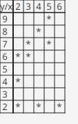

# Laboratorium 7

Celem laboratorium jest zapoznanie się z mechanizmem wyjątków oraz poprawienie wydajności rysowania zwierząt na mapie.

Treść laboratorium powstała we współpracy z Norbertem Morawskim.

## Przydatne informacje

* Wyjątki są mechanizmem pozwalającym przekazywać informację o błędzie pomiędzy odległymi fragmentami kodu.
* Zgłoszenie błędu odbywa się poprzez *rzucenie wyjątku*. W Javie służy do tego słowo kluczowe `throw`:

```java
throw new IllegalArgumentException("ABC argument is invalid")
```
* Nieobsłużony wyjątek powoduje przerwanie działania aplikacji.
* Obsługa wyjątków odbywa się za pomocą mechanizmu *przechwytywania wyjątków*. W Javie służy do tego konstrukcja
  `try...catch`:

```java
try {
  // kod który może rzucić wyjątek
} catch(IllegalArgumentException ex) {
  // kod obsługi wyjątku
}
```
Wyjątek może być rzucony na dowolnym poziomie w kodzie, który otoczony jest blokiem `try`. Tzn. w kodzie tym może być
wiele zagnieżdżonych wywołań funkcji, a i tak blok `try` przechwyci taki wyjątek, pod warunkiem, że nie zostanie on obsłużony
na niższym poziomie.

* JavaFX to [framework](https://pl.wikipedia.org/wiki/Framework) do obsługi środowiska graficznego.
* Aplikacja JavaFX składa się z:
    * `Stage` - okno aplikacji,
    * `Scene` - aktualna zawartość aplikacji (np. ekran symulacji, ekran podsumowania)
    * Scena zawiera wiele instancji `Node`. Są nimi m.in. przyciski, pola tekstowe, kontenery (`VBox`, `HBox`, `GridPane`, itp.).
* Główna klasa w aplikacji powinna dziedziczyć po `Application` i implementować metodę `start()`.
* Minimalna aplikacja powinna stworzyć jedną scenę, przypiąć ją do `Stage` i wyświetlić.


## Zadania do wykonania

Opis skrócony:

1. Dodanie obsługi wyjątków.
2. Dodanie klasy `MapBoundary`.
3. Szkielet aplikacji JavaFX.
4. Wyświetlanie mapy w GUI.

### Obsługa wyjątków

1. Wykorzystaj klasy z laboratorium 6.
2. W metodzie odpowiedzialnej za zamianę argumentów aplikacji na ruchy zwierzęcia rzuć wyjątek `IllegalArgumentException`,
  jeśli którykolwiek z parametrów nie należy do listy poprawnych parametrów (`f`, `forward`, `b`, `backward`, etc.).
  Jako przyczynę wyjątku wprowadź łańcuch znaków informujący, że określony parametr jest niepoprawny, np.
  `new IllegalArgumentException(argument + " is not legal move specification")`.
3. W metodach odpowiedzialnych za dodawanie elementów do mapy, jeśli dodanie elementu na wybrane pole jest niemożliwe
   rzuć wyjątek `IllegalArgumentException`, podając jako przyczynę łańcuch znaków zawierający
   informację o tym, które pole jest błędne. Wyjątek zastępuje sygnalizowanie błędu przy pomocy zwracania wartości `false`.
4. Obsłuż oba wyjątki w metodzie `main` klasy `World`. Obsługa powinna polegać na wyświetleniu komunikatu wyjątku
   oraz zakończeniu działania programu, a konstrukcja `try` powinna obejmować cały kod znajdujący się w metodzie `main`.
5. Przetestuj działanie wyjątków poprzez podanie nieprawidłowego parametru ruchu oraz dodanie do mapy dwa razy tego
   samego zwierzęcia. Efektem powinno być kontrolowane zakończenie działania programu.
6. Zaktualizuj testy metody `place` oraz klasy `OptionsParser`, aby były zgodne z nowym kontraktem.


### Wyodrębnienie klasy reprezentującej obszar zajęty przez obiekty

1. Dodaj nową klasę `MapBoundary`, która będzie odpowiedzialna za przechowywanie informacji o obszarze zajmowanym przez
   obiekty na mapie.
2. Klasa ta powinna implementować interfejs `IPositionChangeObserver`.
3. Klasa `MapBoundary` powinna zawierać dwa zbiory uporządkowane obiektów na mapie - jeden wzdłuż osi X, drugi wzdłuż
   osi Y. Ponieważ porządek musi być zupełny, w przypadku obiektów o tym samym indeksie wzdłuż danej osi porównaj
   drugą współrzędną oraz typ obiektu (zwierzę/trawa). Przemyśl jakie dokładnie obiekty należy trzymać w tych zbiorach.
   Czy mogą to być obiekty `Animal`? Co się stanie gdy zwierzę zmieni pozycję?
4. Dodanie obiektu do mapy `GrassField` (`UnboundedMap`) powinno skutkować dodaniem tego obiektu do instancji
   `MapBoundary`.
5. Obiekty mają być dodawane w ten sposób, że skrajne pozycje na liście zawsze zajmowane są przez obiekty które mają
   odpowiednio największą oraz najmniejszą wartość indeksu w danym wymiarze.
6. Mapa powinna korzystać z instancji klasy `MapBoundary` w celu efektywnego obliczania obszaru, który ma zostać
   wyświetlony.
7. Otaguj gotowe rozwiązanie jako lab7.

### Szkielet aplikacji JavaFX

1. W `build.gradle`:
    1. Dodaj `id 'org.openjfx.javafxplugin' version '0.0.10'` do sekcji `plugins`.
    2. Dodaj pod `repositories` sekcję:
        ```gradle
        javafx {
            version = "17"
            modules = [ 'javafx.controls' ]
        }
        ```
2. Utwórz nowy pakiet `agh.ics.oop.gui`.
3. Odśwież konfigurację Gradle'a (`Ctrl+Shift+O`).
4. Utwórz klasę `App` dziedziczącą z `Application` z pakietu `javafx.application`.
5. Zaimplementuj metodę `public void start(Stage primaryStage)`.
    * Będzie to metoda uruchamiająca interfejs graficzny Twojej aplikacji.
    * Na razie możesz w ciele metody wpisać `primaryStage.show();`. Wyświelti to puste okno aplikacji.
6. W metodzie `main` w `World` dodaj `Application.launch(App.class, args);`
    * Spowoduje to uruchomienie okna JavaFX.
7. Zobacz czy okno pokazuje się (może być nieresponsywne, ale powinno się pokazać).
*Pamiętaj, żeby importować brakujące klasy z pakietu `javafx`*

### Wyświetlanie mapy w GUI

1. W klasie `App` dodaj:
    ```java
    Label label = new Label("Zwierzak");
    Scene scene = new Scene(label, 400, 400);
    
    primaryStage.setScene(scene);
    primaryStage.show();
    ```
    Spowoduje to:
    * Utworzenie nowej etykiety z treścią `Zwierzak`.
    * Utworzenie sceny zawierającej tylko obiekt `Label`, z wymiarami 400 x 400 pikseli.
    * Ustawienie sceny jako aktywnej.
    * Pokazanie okna aplikacji.
2. Zmodyfikuj kod tak, aby zamiast pojedynczej etykiety wyświetlał siatkę z etykietami.
    * *Wskazówka:* Skorzystaj z klasy [`GridPane`](http://tutorials.jenkov.com/javafx/gridpane.html). Przydatne może być ustawienie `grid.setGridLinesVisible(true);`.
3. Przenieś kod inicjalizacyjny mapy z klasy `World` do `App` (możesz skorzystać z metody `init()`).
4. Użyj `getParameters().getRaw()` żeby odczytać parametry linii komend.
5. Wykorzystaj `AbstractWorldMap`, tak aby siatka odpowiadała rozmiarom i orientacji mapy. Pamiętaj, że współrzędne `y` rosną w kierunku "do góry", w `GridPane` jest na odwrót.
6. Dodaj w pierwszej kolumnie i w pierwszym rzędzie wartości współrzędnych (podobnie jak robi to `MapVisualizer`).
7. Do pozostałych wierszy dodaj obiekty z mapy.
8. Dodaj do siatki rozmiary kolumn i wierszy. Skorzystaj z:
    * `grid.getColumnConstraints().add(new ColumnConstraints(width));`
    * `grid.getRowConstraints().add(new RowConstraints(height));`
8. Wyśrodkuj etykiety korzystając z wywołania `GridPane.setHalignment(label, HPos.CENTER)`.
9. Aktualnie, twój program powinien wyglądać mniej więcej tak (użyto mapy `GrassField`, dodano 2 zwierzaki):<br>

