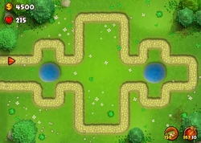
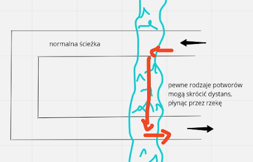

# Tower Defence
### Cel projektu
Celem projektu jest stworzenie gry z gatunku Tower Defence. 
Gracz posiada widok na dwuwymiarową mapę, na której może 
budować różnego rodzaju wieże, aby zabić potwory w alei, 
nim te dotrą do jej końca.
### Mapa
Mapa składa się z małych kwadratów (grid) - z jednego końca 
mapy do drugiego przechodzi aleja (możliwe rozgałęzienia alei,
tak samo wejście i wyjście nie musi być jedno), na której 
pojawiają się wrogie stwory. Na pozostałej części planszy 
gracz może budować wieże (wieże mają konkretny rozmiar, 
zajmują np kratkę 1x1 czy 3x2).

#### Przykładowa mapa i widok gry

**(rozszerzenie)** Na mapie znajdują się elementy krajobrazu:
 - góra - jeśli zbudujemy na niej wieżę, to dajemy jej premię 
do zasięgu.
 - bagno - tworzone tylko na alei, daje premię do prędkości 
i ataku potworom, a osłabia i spowalnia naszych rycerzy
 - rzeka - płynie ona w poprzek alei, zakłada istnienie 
drugiego rodzaju stworów, które mogą skrócić sobie drogę, 
przepływając przez rzekę do dalszego fragmentu alei
 

**(rozszerzenie ++)** Nie tworzymy mapy ręcznie “na sztywno”,
tylko implementujemy algorytm tworzenia mapy, gwarantujący 
przynajmniej jedno wejście i wyjście, a także ciągłość alei,
dodatkowo wstawiający losowo w odpowiednie miejsca elementy
krajobrazu.

### Wieże
W zależności od rozwinięcia projektu i inwencji twórcy 
wyróżniamy różne rodzaje wież:
 - strzelające - zadające obrażenia pojedynczemu stworowi, 
który jest najdalej w alei i jest w jej zasięgu
 - wybuchające - jak wyżej, tylko zadają obrażenia wszystkim 
stworom na danym obszarze od trafienia
 - **(rozszerzenie)** tworzące - modyfikacją do znanego 
trybu gry jest wprowadzenie wieży, która co pewien okres
czasu tworzy własne stwory - rycerzy, którzy na alei będą 
walczyć z potworami. Można założyć, że ta wieża wymaga 
bezpośredniego dostępu do alei, by wyznaczenie miejsca 
generowania rycerzy było jednoznaczne. Rycerze idą 
zawsze w stronę początku alei, nie “gonią” potworów, 
które przeszły już za stworzony obiekt tego rodzaju. 
Walka polega na zatrzymaniu się rycerzy i potworów 
w miejscu spotkania na alei i iteracyjnym zadawaniu 
obrażeń rycerzom i potworom w tym miejscu. 
(rozpisane w dziale **Potwory i rycerze**).

Wieżę charakteryzują następujące statystyki:
 - rozmiar
 - koszt budowy
 - zadawane obrażenia
 - zasięg
 - (tworzące) częstotliwość tworzenia

Oczywiście można stosować różne modyfikacje w celu 
urozmaicenia projektu, np niektóre wieże mogą mieć 
efekt spowalniający stwory czy nakładające truciznę 
(ciągłe obrażenia przez pewien czas po trafieniu).

Gracz buduje wieże, korzystając z menu znajdującego 
się obok mapy. Widzi ilość swoich monet, a 
także koszt i statystyki wież. Gracz stawia wieżę np 
poprzez przeciągnięcie jej z menu na mapę i wstawienie 
jej na wolne kratki.

**(rozszerzenie)** Poprzez kliknięcie wieży na mapie można ją 
ulepszyć za określoną kwotę (zwiększenie statystyk)

**(rozszerzenie)** Gracz oprócz wież może wstawić na aleję 
elementy tymczasowe, np:
 - barykadę, która przez pewien okres czasu zatrzymuje 
potwory (można ustawić pasek zdrowia barykady, dzięki
czemu im więcej stworów będzie, tym krócej barykada je 
zatrzyma)
 - bombę, która zadaje obrażenia obszarowe w miejscu wstawienia

### Potwory i rycerze
Potwory pojawiają się na początku alei i dążą do jej końca. 
Rycerze pojawiają się przy wieży tworzącej (zamku) 
i idą w stronę początku alei.

Charakteryzuje ich:
 - prędkość ruchu
 - zadawane obrażenia
 - punkty życia
 - (potwory) ilość monet za zabicie

**Jak wygląda walka:**

Do spotkania dochodzi na jednej kratce alei
sumujemy całkowite obrażenia wszystkich potworów znajdujących
się na kratce i równomiernie rozdzielamy je na wszystkich 
rycerzy na tej kratce (analogicznie w drugą stronę).
Jeśli na kratce nie ma już rycerzy, wszystkie potwory na
kratce idą dalej (analogicznie dla rycerzy)

### Zakończenie gry
Gracz ma określoną ilość życia. W momencie, gdy stwór dojdzie
do końca alei, zadaje on graczowi pojedyncze obrażenia 
w wysokości swojej statystyki obrażeń. Gdy wartość życia 
spadnie do zera, gracz przegrywa.
Mapa ma określoną ilość potworów, którą generuje. Gdy ta 
ilość się skończy, gracz wygrywa.
**(rozszerzenie)** Gra stopniuje poziom trudności z czasem 
gry. Na początku pojawiają się słabe potwory w niewielkiej 
ilości, z czasem ich ilość i statystyki się zwiększają.

### Inspiracja
seria gier TD Bloons
